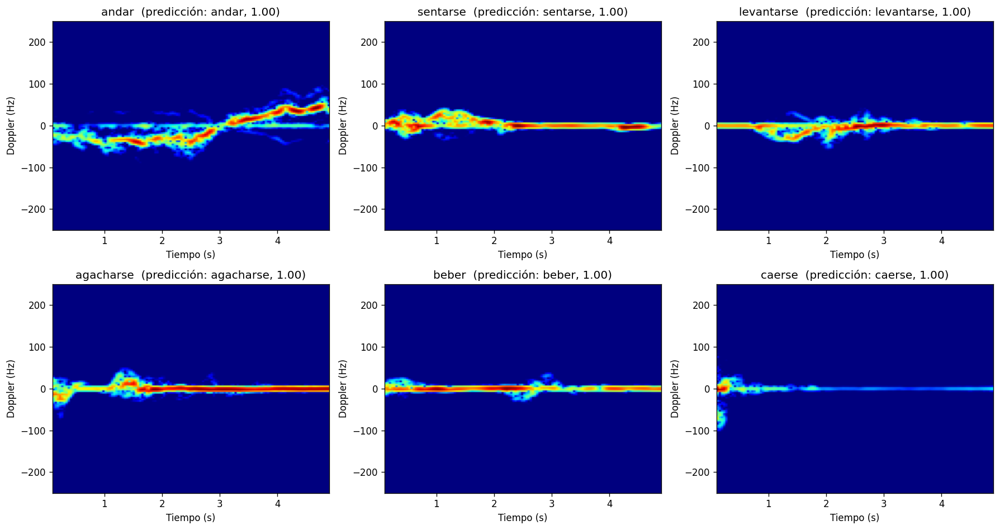

# Reconocimiento de actividades humanas con radar micro-Doppler

Clasificación de 6 actividades humanas (**andar, sentarse, levantarse, agacharse, beber y caerse**) a partir de señales de un radar FMCW, transformadas en **espectrogramas micro-Doppler** y clasificadas con **redes neuronales convolucionales** en PyTorch.

El mejor modelo (ResNet18 con *fine-tuning*) alcanza un **95,3 % de precisión** sobre personas que no ha visto durante el entrenamiento, y detecta **las 36 caídas del conjunto de test sin falsas alarmas**.



---

## Índice

1. [Motivación](#motivación)
2. [Dataset](#dataset)
3. [Pipeline](#pipeline)
4. [Evaluación](#evaluación)
5. [Resultados](#resultados)
6. [Hallazgos](#hallazgos)
7. [Estructura del repositorio](#estructura-del-repositorio)
8. [Cómo ejecutarlo](#cómo-ejecutarlo)
9. [Conclusión](#conclusión)

---

## Motivación

Un radar puede detectar el movimiento de una persona **sin cámaras**, respetando su privacidad y funcionando a oscuras o a través de obstáculos ligeros. Cada parte del cuerpo se mueve a una velocidad distinta y produce su propio desplazamiento Doppler. Cada actividad deja una estela característica.

La aplicación más directa es la **detección de caídas en personas mayores**, por lo que el recall de la clase *caerse* es la métrica más importante del proyecto.

## Dataset

[*Radar signatures of human activities*](https://researchdata.gla.ac.uk/848/), Universidad de Glasgow.

| Característica | Valor |
|---|---|
| Radar | FMCW a 5,8 GHz |
| Chirp | 1 ms, 128 muestras |
| Ancho de banda | 400 MHz (100 MHz en algunas campañas) |
| Grabaciones | 1754, en 7 campañas |
| Sujetos | 106 (identificados por campaña + persona) |
| Duración | 5 s (10–20 s en *andar*) |

| Actividad | Grabaciones |
|---|---|
| Andar | 312 |
| Sentarse | 312 |
| Levantarse | 311 |
| Agacharse | 311 |
| Beber | 311 |
| Caerse | 197 |

## Pipeline

```
.dat (IQ crudo)
  │  cargar_dat
  ▼
matriz muestras × chirps
  │  eliminar offset DC → FFT de distancia → filtro MTI
  ▼
mapa distancia-tiempo
  │  detectar_rango → casillas donde está la persona
  ▼
señal en tiempo lento (suma compleja de esas casillas)
  │  STFT
  ▼
espectrograma micro-Doppler (dB)
  │  
  ▼
CNN → actividad
```

**1. Distancia.** Una FFT sobre cada chirp convierte la señal en un mapa distancia-tiempo. El filtro **MTI** elimina los elementos estáticos como paredes y muebles.

**2. Detección de rango.** `detectar_rango` localiza las casillas donde está la persona: crece a partir del pico de energía mientras se supera *mediana + 10 dB*, y tolera un único valle entre casillas válidas, eliminando asi el mayor ruido posible.

**3. Señal en tiempo lento.** Las casillas detectadas se suman **en complejo**, conservando la fase, que es donde está la información Doppler.

**4. Espectrograma.** Una STFT sobre esa señal muestra qué velocidades hay en cada instante. Se usa el espectro completo (positivas: la persona se acerca; negativas: se aleja).

**5. Imagen para la red.** Todas las grabaciones se igualan a sus primeros 5 s.

## Evaluación

La partición se hace **por sujeto**, no por grabación: todas las grabaciones de una persona van al mismo conjunto.

| Conjunto | Sujetos | Grabaciones |
|---|---|---|
| Train | 74 | 1224 |
| Validación | 16 | 253 |
| Test | 16 | 277 |

Si la misma persona apareciera en train y en test, la red podría aprender a reconocer *a la persona* en lugar de *la actividad*, y la precisión saldría inflada.

La partición usa una semilla fija (`particion.csv`) y es la misma para todos los experimentos. En cada entrenamiento se guarda el modelo de la época con menor pérdida de validación, y el test se evalúa una sola vez al final.

## Resultados

| # | Modelo | Parámetros entrenables | Acc. test | Recall caerse | Precisión caerse |
|---|---|---|---|---|---|
| 1 | CNN propia (3 bloques conv) | 2,1 M | 90,6 % | 97,2 % | 92,1 % |
| 2a | ResNet18 congelada (solo `fc`) | 3 078 | 83,0 % | 97,2 % | 94,6 % |
| **2b** | **ResNet18 *fine-tuning*** | **11,2 M** | **95,3 %** | **100 %** | **100 %** |

Configuración común: Adam, 30 épocas, batch 32, semilla 42. Tasa de aprendizaje 1e-3 en los experimentos 1 y 2a, y 1e-4 en el 2b. Las métricas completas y las matrices de confusión están en [`reports/experimentos.md`](reports/experimentos.md).

**CNN propia:** tres bloques Conv 3×3 → BatchNorm → ReLU → MaxPool (16, 32 y 64 canales), seguidos de Dropout(0,5) → Linear(16384 → 128) → ReLU → Dropout(0,5) → Linear(128 → 6).

**ResNet18:** preentrenada con ImageNet. El canal único del espectrograma se repite tres veces, se aplica la normalización de ImageNet y la capa final se sustituye por una de 6 salidas (`src/resNetEspectro.py`).

F1 por clase en test:

| Actividad | CNN propia | ResNet18 congelada | ResNet18 *fine-tuning* |
|---|---|---|---|
| Andar | 0,941 | 0,920 | 1,000 |
| Sentarse | 0,936 | 0,831 | 0,980 |
| Levantarse | 0,980 | 0,828 | 0,969 |
| Agacharse | 0,824 | 0,743 | 0,891 |
| Beber | 0,810 | 0,727 | 0,889 |
| Caerse | 0,946 | 0,959 | 1,000 |

## Hallazgos

**El *fine-tuning* supera con claridad a la red congelada.** Es la misma ResNet18 con los mismos pesos de partida: congelada da un 83 % y ajustada, un 95 %. Las características aprendidas con fotos de ImageNet no sirven tal cual para espectrogramas de radar, pero son un buen punto de partida para aprender las que sí sirven. Con solo 1224 imágenes de entrenamiento, partir de esos pesos rinde más que entrenar una red desde cero.

## Estructura del repositorio

```
radar-micro-Doppler/
├── notebooks/
│   ├── 1.0-tratamiento-datos.ipynb          # Exploración de los datos crudos y conversión a señales (Colab)
│   ├── 2.0-espectrograma-microDoppler.ipynb # Desarrollo del espectrograma y del dataset de imágenes
│   ├── 3.0-CNN-desde-cero.ipynb             # Experimento 1: CNN propia
│   ├── 3.1-ResNet18-pruebas.ipynb           # Experimentos 2a y 2b: ResNet18 congelada y fine-tuning
│   └── 4.0-prueba-individual.ipynb          # Demo: predicción sobre una grabación
├── src/
│   ├── data.py             # Lectura de .dat, metadatos del nombre y correcciones de etiquetas
│   ├── preprocessing.py    # FFT, MTI, detección de rango, señal temporal y espectrograma
│   ├── visualization.py    # Gráficas: mapa distancia-tiempo, energía, señal y espectrograma
│   └── resNetEspectro.py   # Adaptación de ResNet18 a espectrogramas de 1 canal
├── reports/
│   └── experimentos.md     # Métricas completas de cada experimento
├── data/                   
│   └── processed/
│       ├── senales/                 # Señal en tiempo lento de cada grabación (.npz)
│       ├── espectrogramas_5s.npz    # 1754 espectrogramas 128×128
│       ├── metadatos.csv            # Actividad, persona, campaña... de cada grabación
│       └── particion.csv            # Train / valid / test por sujeto
├── models/                 # Pesos entrenados (.pt)
└── requirements.txt
```

## Cómo ejecutarlo

```bash
git clone git@github.com:juuanmartiinez/radar-micro-Doppler.git
cd radar-micro-Doppler
python -m venv .venv
source .venv/bin/activate
pip install -r requirements.txt
```

## Conclusión

Este proyecto me ha servido para seguir tocando tecnologías como las redes convolucionales (esta vez poniendolas en uso desde 0) o explorar  otras alternativas
como el fine-tuning y mediante datos, ser capaz de decir cual puede solucionar mi problema de la manera más eficaz. 

Por otro lado, me resultaba bastante interesante traducir las salidas de un Radar a información que de verdad es valiosa y comprensible para cualquiera.


## Autor

Juan Martínez Moreno — [github.com/juuanmartiinez](https://github.com/juuanmartiinez)